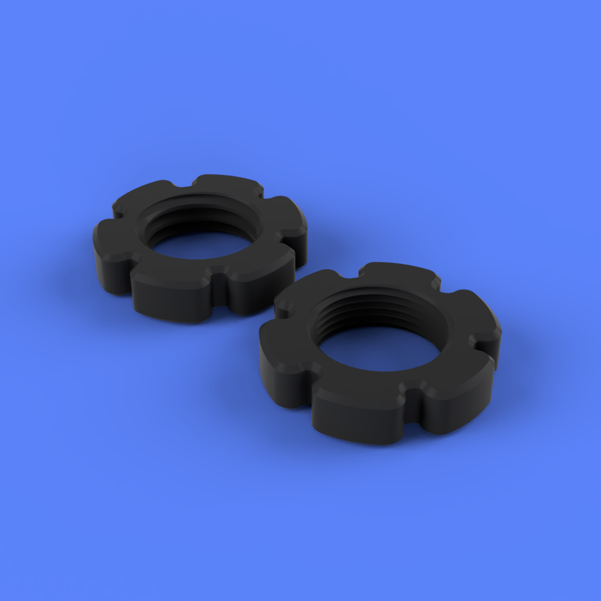
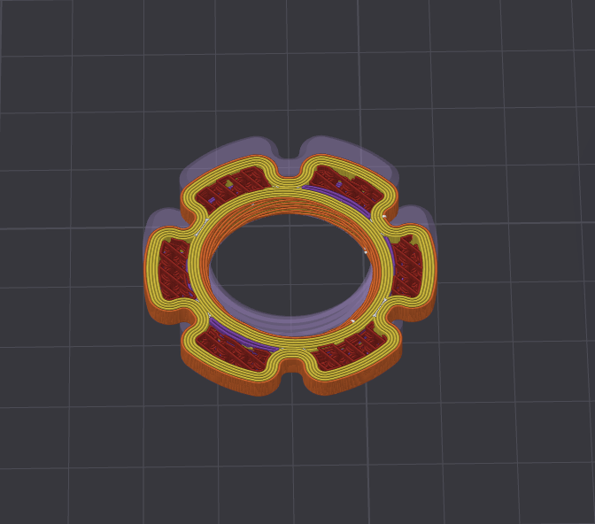

# 24mm Nut - Hex Flower - Single/Double Threaded

## Summary
* Tapered thread entry for easier initial threading
* 40mm outer diameter with smooth "flower petal" edges
  * Petal shape design causes wall overlap when printing with 5+ walls, 0.4 nozzle, increasing part strength
  * Petal shape gives finger grip points and allows for wrench use
* [Experimental] Double-threaded version has 180 degree offset thread for easier initial threading (Doubles the chance of threads catching)
  

## [Print Files](Files/)  

## Printing

    0.2mm layer height
    Standard strength (5 wall) profile
    20% gyroid or crosshatch infill

  
