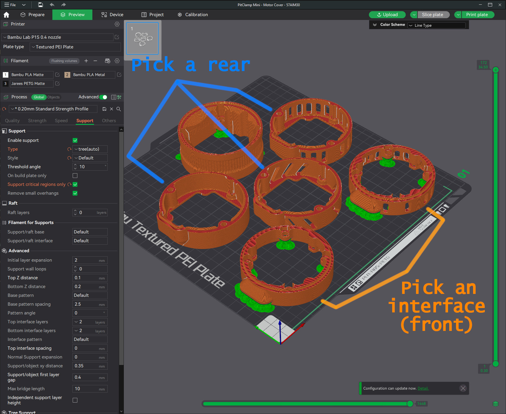

### Note  
This 3mf is for Bambu slicer until someone commits a version for another slicer.  

I have learned that the support and infill settings will not import properly to other slicers.  

Use these settings if you are using another slicer:  

    0.2mm layer height
    Standard strength (5 wall) profile
    20% gyroid or crosshatch infill
    Tree/organic Supports ~10deg overhang setting
    "Support critical regions only"

  