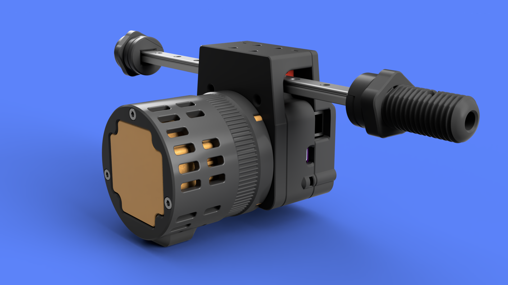
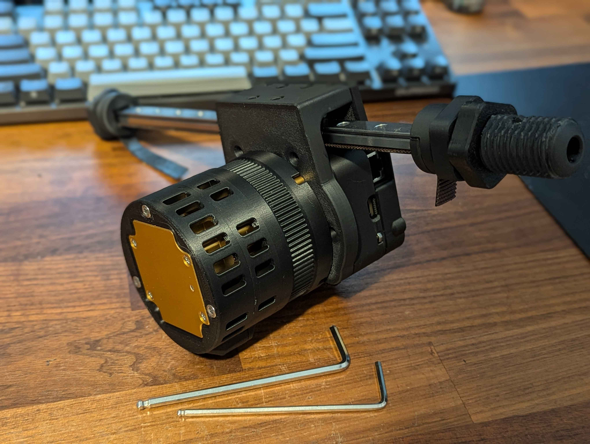
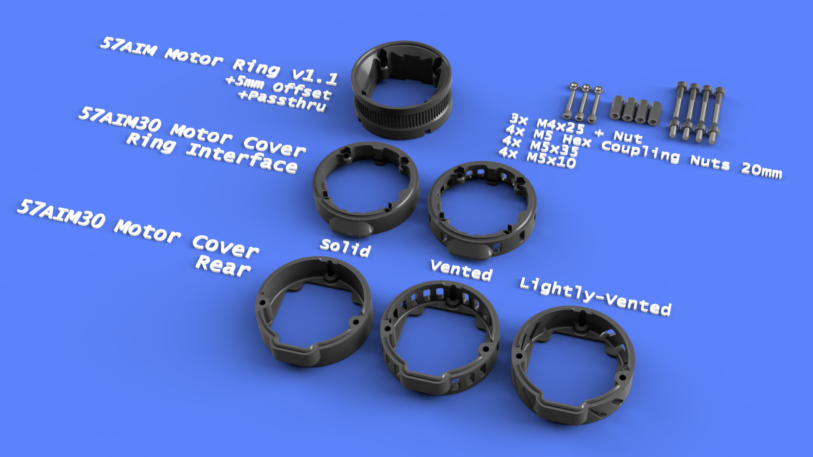

# PitClamp Mini Motor Cover

## Summary    
This is a motor cover for OSSM setups that utilize the [PitClamp Mini](https://github.com/armpitMFG/PitClamp-Mini) mounting system combined with the [OSSM v2.x Board AIO Motor Head Mod](https://github.com/armpitMFG/OSSM-Parts/tree/main/OSSM%20v2.x%20AIO%20Motor%20Head%20Mod)  

Interlocking interface helps prevent fluid intrusion.

The cover parts come in different levels of ventilation or sealed.  
Choose what will work best for your use; Motor Cover pieces are interchangable.  

### Requires v1.1 PitClamp Mini Motor Ring  
Compatible with all PitClamp Mini bases, just needs a new motor ring to support the cover mounting.

### Motor Support
- 57AIM30
- 42AIM30 (Future)
- 42AIM15 (Future, maybe..)  

## [Print Files](Files/)  
All parts are intended to print in the provided file orientation (as pictured below)  
There are various design tricks that take advantage of 0.2mm layer height in this default orientation.

## Bill Of Materials
  - 3x M4x25 Socket Head Cap Screw
  - 3x N4 Nut
  - [4x M5 Hex Coupling Nuts 20mm](https://www.amazon.com/uxcell-0-8-Pitch-Length-Stainless-Coupling/dp/B07JPYF4DC/) (Just for reference, likely better prices around)
  - 4x M5x10 Socket Head Cap Screw
  - 4x M5x35 Socket Head Cap Screw 
    - (It's possible to use 2x M5x30 + 2x M5x35) 
    - [OR 4x M5x30, though not recommended]

  

## Assembly

Route the cable through Ring v1.1 Passthru hole, slide motor into place  
Insert 4x M5 Hex Coupling Nuts 20mm into Ring v1.1 nut slots. ***MUST BE 20mm***  
Attach motor head ([OSSM v2.x Board AIO Motor Head Mod](https://github.com/armpitMFG/OSSM-Parts/tree/main/OSSM%20v2.x%20AIO%20Motor%20Head%20Mod) recommended) using 4x M5x35  
Insert 3x M4 nuts into Ring Interface nut slots  
Slide Ring Interface into position against Ring v1.1 with cable routed  
Secure Ring Interface using 4x M5x10 into Hex Coupling Nuts  
Plug motor cable into motor  
Slide Rear into position against Ring Interface
Secure Rear using 3x M4x25  

## Updates
  - 09.30.2024 - v1.0 Release

## Printing

**Recommend using preconfigured 3mf file - [PitClamp Mini - Motor Cover- 57AIM30.3mf](Files/Preconfigured%203mf%20Files/)** just remove the parts you don't need.

    0.2mm layer height
    Standard strength (5 wall) profile
    20% gyroid or crosshatch infill
    Tree/organic Supports ~10deg overhang setting
      "Support critical regions only"
  
Supports required for:
  - PitClamp Mini - Ring v1.1 - 57AIM - 5mm Offset +Passthru
  - PitClamp Mini - Motor Cover - 57AIM30 - Rear (any)

  