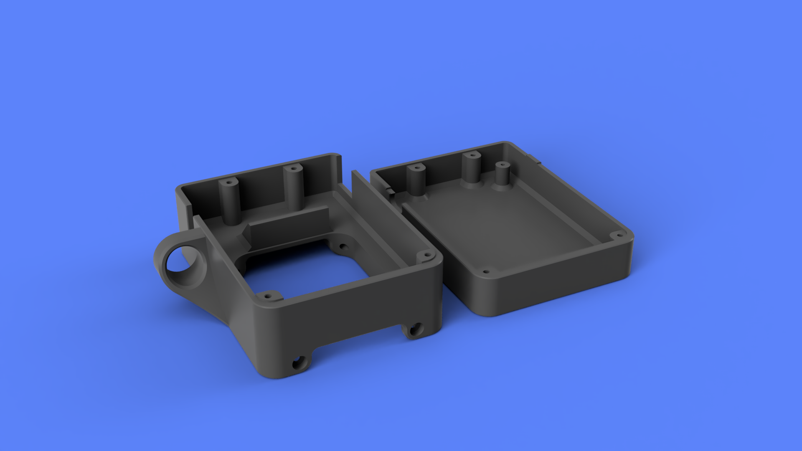
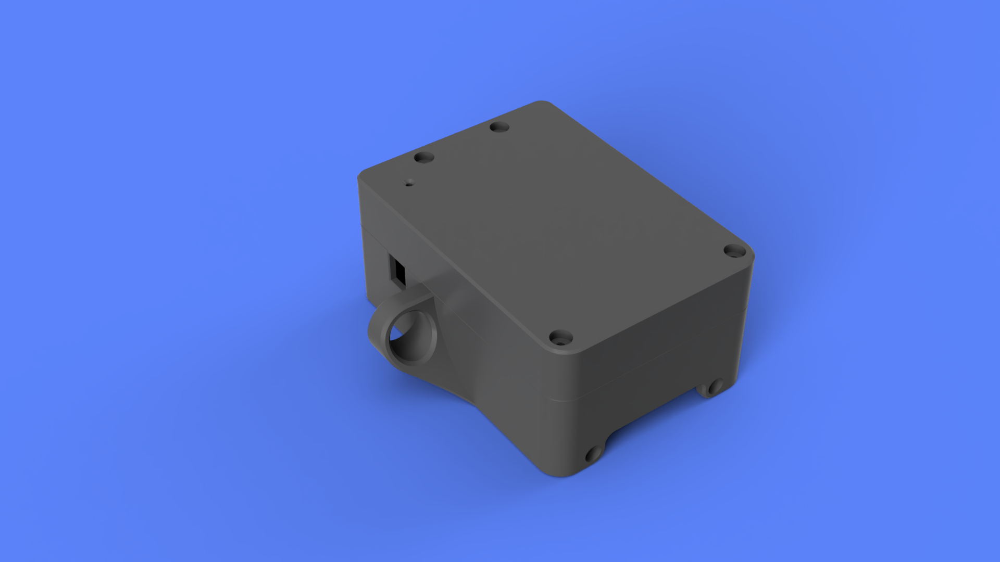

## OSSM Reference PCB Housing - Remix w/ Strain Relief

  
  

**Summary**  
Adds a strain relief for the power plug with a 12.5mm inner diameter (a little larger than typical barrel plug)  
Reduces size and number of holes on the top for a more minimal look and reduced LED brightness  
Widened footprint by 2mm total to add more tolerance for board fit
