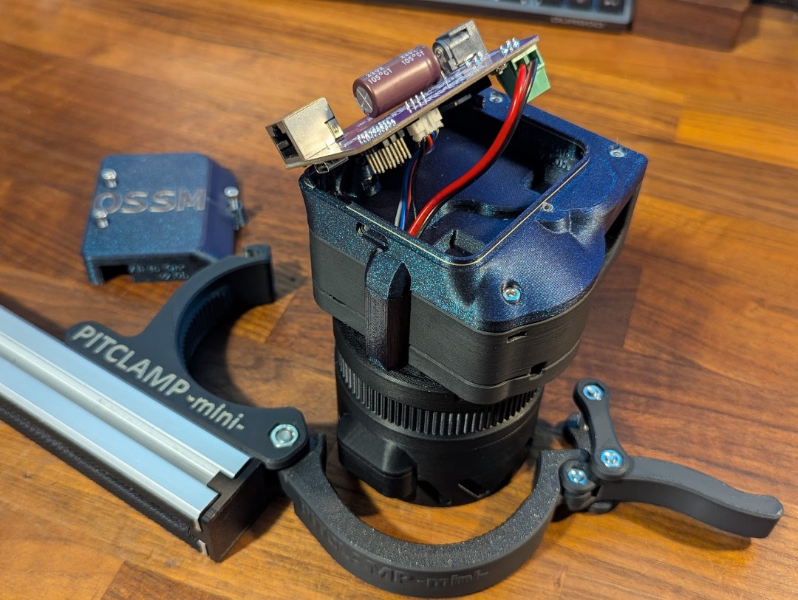
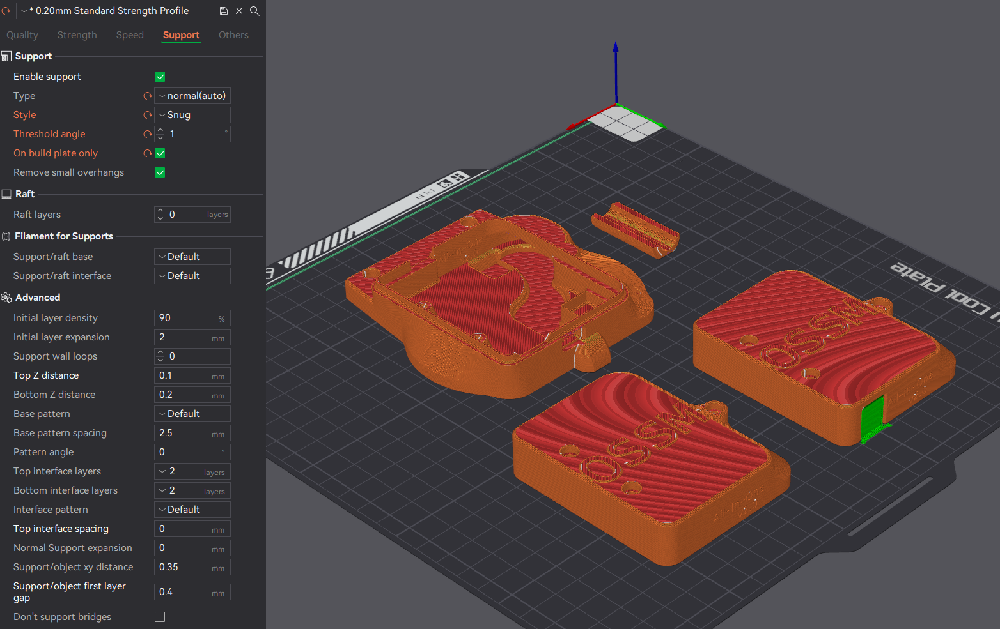

# OSSM v2 All In One PCB Backpack Mod

|||
| --- | --- |

## Summary   
This is a mod that converts the default "OSSM - Body - Cover" into a PCB enclosure with cable routing designed to pair up with my other mod - [OSSM Motor Cover](https://github.com/armpitMFG/OSSM-Parts/tree/main/OSSM%20Motor%20Cover) - on 57AIM30 "Gold Motor" setups.  

This OSSM setup utilizes the [PitClamp Mini](https://github.com/KinkyMakers/OSSM-hardware/tree/master/Printed%20Parts/Mounting/PitClamp%20Mini) mounting system.

Interlocking interface helps prevent fluid intrusion.

Print+Part kits: https://www.etsy.com/listing/1861883228/ossm-all-in-one-pcb-backpack-mod-print

### Requires v1.1 PitClamp Mini Motor Ring  

## Capacitor Support
- Supports capacitors up to 18mm diameter, should fit all existing v2.x reference boards

### Motor Support
- 57AIM30
- iHSV57
  - No cover mod for this motor, no passthru ring
  - Use 4pin header for motor signal

## [Print Files](Files/)  
 - All parts are intended to print in the provided file orientation (as seen in slicer preview below)  
   - Auto-orient may position parts incorrectly
 - Variation available for covered RJ45 port (Useful if you have a wireless remote)
 - There may be various design tricks that take advantage of 0.2mm layer height in this default orientation

## Bill Of Materials
  - 2x M3x25 Socket Head Cap Screw
  - 4x M3x12 Socket Head Cap Screw
  - 6x M3 Hex Nut 
    - (4 are from original Cover)
  - (Optional) cable strain relief add-on
    - 2x M3x12
    - 2x M3 Hex Nut
  - (Optional) Magnetic Faceplate
    - 2x 10x2mm Neodymium magnets

Print+Part kit: https://www.etsy.com/listing/1861883228/ossm-v2-all-in-one-pcb-backpack-mod

| | |
| --- | --- | --- |

## Assembly

0. If you plan to use a Motor Cover, follow that install procedure first.  
   If you plan to use magnetic faceplates, press-fit magnets into "Backpack - Cap".
1. Install the 2x m3x12 + nuts with cable strain relief (or without a relief installed if you plan to use one in the future).
2. Remove "OSSM - Body - Cover" from the OSSM if installed, ensure 4x M3 nuts are installed in "OSSM - Body (Middle and Bottom)" slots.  
3. Route wires through "Backpack - Base". This is easiest if you are able to feed individual wires through, but the hole should accommodate the 4 pin plug if it is inserted before the power leads.  
4. Set the Base in place on "OSSM - Body - Middle" and secure it loosely with 4x M3x12 screws.  
5. Insert 2x M3 nuts into Base inner slots past the notch. Be careful to keep these aligned in future steps.  
6. Attach 4 pin motor signal cable and power leads to the OSSM Reference Board.  
7. Set the board in place, temporarily, guiding wires into the recessed areas and removing slack when necessary.
8. Insert "Backpack - Wire Cover" into place over the wire between "Backpack - Base" and "Ring v1.1". The smaller ridge fits into the Ring passthru hole.  
9.  Lean the OSSM Reference Board out of the way and finish tightening the two lower Base screws while securing the Wire Cover in place. (Hold nuts in place with a small tool if they spin in place)  
10. Finish tightening the two upper Base screws  
11. Set "Backpack - Cap" in place, sliding the right side into the grooves, and secure using 2x M3x25, ensuring the recessed nuts are tightened against and did not slide out of place.

## Updates
  - 05.13.2025 - v2.3b Base Release (M3 nut slot tolerance increased by 0.2mm)
  - 04.13.2025 - v2.3 Release (Bottom M3 nut slots improved for assembly and printability, cable passthru widened, retention ridges added for 10x2 magnets)
  - 03.08.2025 - v2.2 Release (Bottom and Cap right side connection changed for reduced BOM and more reliable assembly)
  - 01.22.2025 - Corrected docs M3 bolt spec. Limited to 20mm.
  - 12.21.2024 - v2.01 Cap update (Universal size, easier printing, magnet inserts)
  - 12.19.2024 - v2.0 Release

## Printing

**Recommend using preconfigured 3mf file - [OSSM v2 AIO PCB Backpack Mod.3mf](Files/Preconfigured%203mf%20Files/)**  
Just pick the Backpack Cap you want to keep and remove the other.

    0.2mm layer height
    Standard strength (5 wall) profile
    20% crosshatch or gyroid infill
    No supports required

