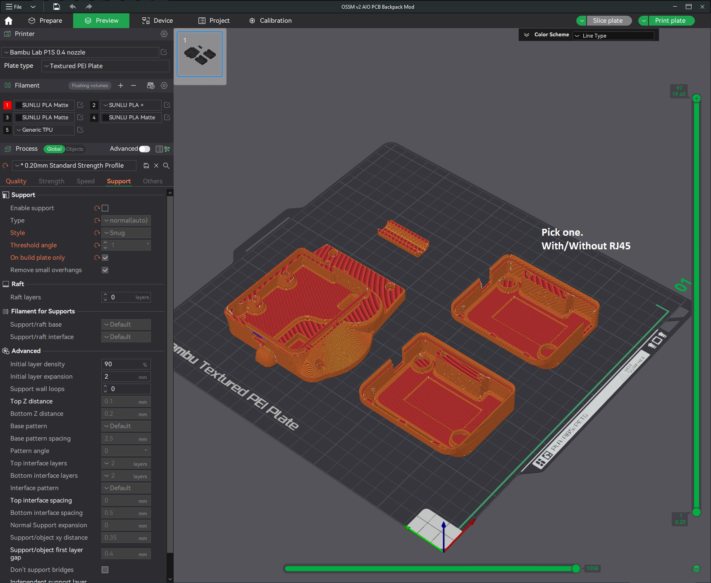

# OSSM v2 All In One PCB Backpack Mod

## Summary   
This is a mod that converts the default "OSSM - Body - Cover" into a PCB enclosure with cable routing designed to pair up with my other mod - [OSSM Motor Cover](https://github.com/armpitMFG/OSSM-Parts/tree/main/OSSM%20Motor%20Cover) - on 57AIM30 "Gold Motor" setups.  

This OSSM setup utilizes the [PitClamp Mini](https://github.com/armpitMFG/PitClamp-Mini) mounting system.

Interlocking interface helps prevent fluid intrusion.

### Requires v1.1 PitClamp Mini Motor Ring  

## Capacitor Support
- Supports capacitors up to 14mm diameter
- If your cap sits much higher than the top of the RJ45 port, let me know so I can make a taller Cap for you

### Motor Support
- 57AIM30
- iHSV57
  - No cover mod for this motor, no passthru ring
  - Use 4pin header for motor signal

## [Print Files](Files/)  
 - All parts are intended to print in the provided file orientation (as seen in slicer preview below)  
   - Auto-orient may position "Backpack - Cap" incorrectly
 - Variation available for covered RJ45 port (Useful if you have a wireless remote)
 - There may be various design tricks that take advantage of 0.2mm layer height in this default orientation

## Bill Of Materials

  - 2x M3x25 Socket Head Cap Screw 
  - 5x M3x12 Socket Head Cap Screw
    - (Slightly longer is fine)
  - 7x M3 Nut 
    - (4 are from original cover)
  - (FUTURE) cable strain relief add-on
    - 2x M3x12
    - 2x M3 Nut

## Assembly

1. If you plan to use a Motor Cover, follow that install procedure first.  
2. Remove "OSSM - Body - Cover" if installed, ensure 4x M3 nuts are installed in "OSSM - Body - Middle" slots.  
3. Route wires through "Backpack - Base". This is easiest if you are able to feed individual wires through, but the hole should accommodate the 4 pin plug if it is inserted before the power leads.  
4. Set the Base in place on "OSSM - Body - Middle" and secure it loosely with 4x M3x12 screws.  
5. Insert 3x M3 nuts into Base inner slots. Be careful to keep these aligned in future steps.  
6. Attach 4 pin motor signal cable and power leads to the OSSM Reference Board.  
7. Set the board in place, temporarily, guiding wires into the recessed areas and removing slack when necessary.
8. Insert "Backpack - Wire Cover" into place over the wire between "Backpack - Base" and "Ring v1.1". The smaller ridge fits into the Ring passthru hole.  
9. Lean the OSSM Reference Board out of the way and finish tightening the two lower Base screws while securing the Wire Cover in place. (Hold nuts in place with a small tool if they spin in place)  
10. Finish tightening the two upper Base screws  
11. Set "Backpack - Cap" in place and secure using 2x M3x25 and 1x M3x12 (Up to M3x25), ensuring the recessed nuts are tightened against.

## Updates
  - 12.19.2024 - v2.0 Release

## Printing

**Recommend using preconfigured 3mf file - [OSSM v2 AIO PCB Backpack Mod.3mf](Files/Preconfigured%203mf%20Files/)** 

    0.2mm layer height
    Standard strength (5 wall) profile
    20% crosshatch or gyroid infill
    Normal/snug (auto) supports
    Supports on buildplate only
  
Supports required for:
  - OSSM v2 AIO PCB Backpack - Cap

  
