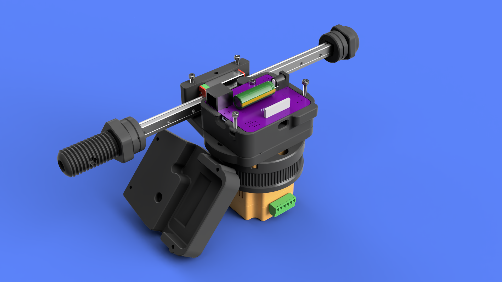
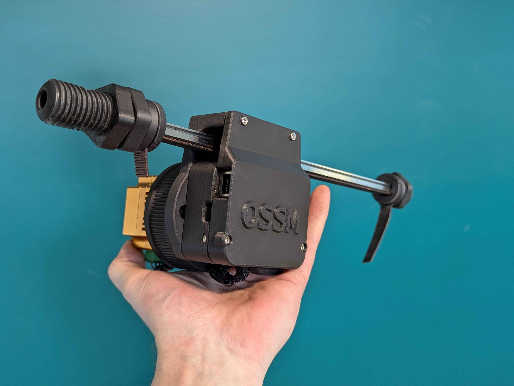
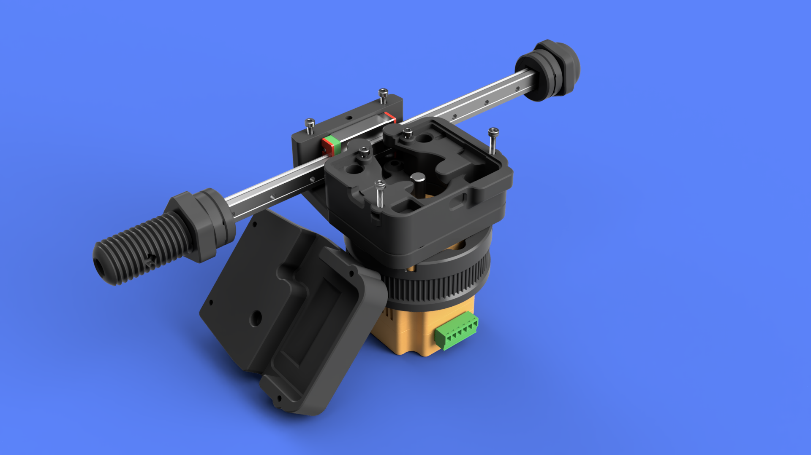
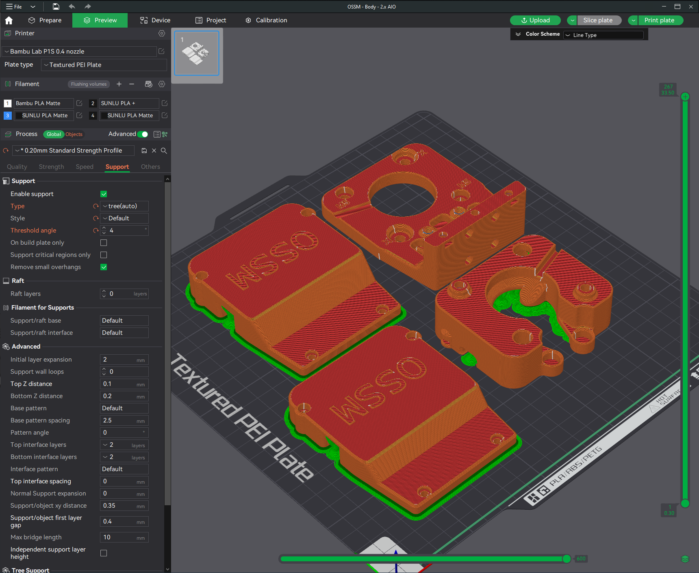

# OSSM v2.x Board AIO Motor Head Mod

## Summary    
This is a modification for the Default OSSM Body Motor Head that houses the v2.x Reference Board as part of the Motor Head.  
This turns the OSSM electronics into a self-contained unit; Just add power and a remote.  
This replaces the Middle and Cover of a Default setup, with an ***optional*** matching Bottom.  

### Motor Support
- 57AIM15
- 57AIM30

To be used in a [PitClamp Mini](https://github.com/armpitMFG/PitClamp-Mini) setup.

**I'm considering this an experimental print.**  
The JST-PH 4 pin header will be in close proximity to the motor pulley. 
I believe I have included enough clearance for a comfortable margin of safety if you remove slack from your cables.  
If this makes you nervous, wait for a fully contained remix that may never come.   

## Capacitor size support
### Choose a cover based on what size capacitor you have
- Cover - Default
  - Up to 12mm diameter
- Cover - Extra Clearance
  - Up to 18mm diameter

## [Print Files](Files/)  
### Requires a motor ring with cable passthru:  
- [PitClamp Mini - Ring - 57AIM - Default - 5mm Offset.stl](https://github.com/armpitMFG/PitClamp-Mini/blob/main/Files/Rings/PitClamp%20Mini%20-%20Ring%20-%2057AIM%20-%20Default%20-%205mm%20Offset.stl) ([.STEP](https://github.com/armpitMFG/PitClamp-Mini/blob/main/Files/Rings/STEP/PitClamp%20Mini%20-%20Ring%20-%2057AIM%20-%20Default%20-%205mm%20Offset.step))  

OR   

- [PitClamp Mini - Ring v1.1 - 57AIM - Default - 5mm Offset.stl](https://github.com/armpitMFG/OSSM-Parts/blob/main/OSSM%20Motor%20Cover/Files/PitClamp%20Mini%20-%20Ring%20v1.1%20-%2057AIM%20-%205mm%20Offset%20%2BPassthru.stl) ([.STEP](https://github.com/armpitMFG/OSSM-Parts/blob/main/OSSM%20Motor%20Cover/Files/STEP/PitClamp%20Mini%20-%20Ring%20v1.1%20-%2057AIM%20-%205mm%20Offset%20%2BPassthru.step))
    - This is an experimental, but likely future standard, ring that will support attaching a rear motor cover.
    - BOM for this ring
      - [4x M5 Hex Coupling Nuts 20mm](https://www.amazon.com/uxcell-0-8-Pitch-Length-Stainless-Coupling/dp/B07JPYF4DC/)
      - 4x M5x35 Socket Head Cap Screw

### Bill Of Materials
    4x M3x10 (12 max) Socket Head Cap Screw
    2x M3x15 (20 max) Socket Head Cap Screw
    4x M3 Nuts
    Plus standard hardware for:
      OSSM Body
      PitClamp Mini Ring

### Assembly

Route the cable through the PitClamp Motor Ring Passthru, slide motor into place.  
Attach Middle to Base through Motor Ring like a normal assembly.  
Route JST-PH 4 pin through wire access hole, then power cables.  
Attach wires to Reference Board v2.x and put the board in place.  
Do cable routing to reduce slack, pinch points, etc.  
Secure the board using 2x M3x10.    
Attach your chosen Cover and secure using 2x M3x10 and 2x M3x15 with nuts in slots.  

### Updates
  - 09.14.2024 - v1.0 Release

## Printing

**Recommend using preconfigured 3mf file - [OSSM - Body - 2.x AIO.3mf](Files/OSSM%20-%20Body%20-%202.x%20AIO.3mf)**

    0.2mm layer height
    Standard strength (5 wall) profile
    20% gyroid or crosshatch infill
    Tree/organic Supports ~4deg overhang setting
  
Supports required for:
  - OSSM - Body - 2.x AIO - Cover (any)
  - OSSM - Body - 2.x AIO - Middle

I recommend using a raft on "OSSM - Body - 2.x AIO - Cover", this will help with support removal as well.

It's a lot of support, but it's a small part.  
Possibly can optimize some of this out in a future rev.  

  
