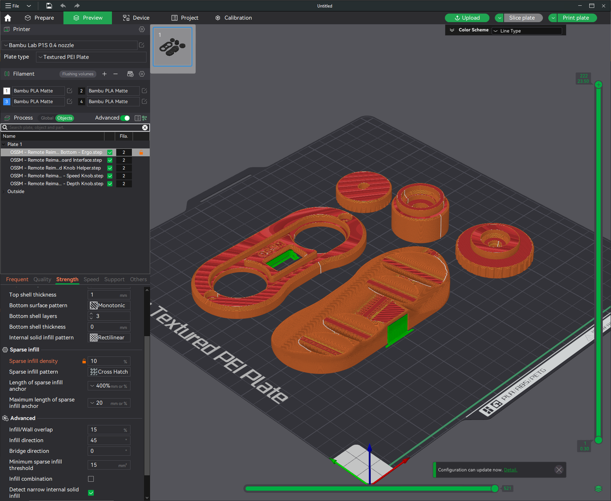

# OSSM Remote Reimagined

## Summary    
Reimagines the OSSM Remote in single-handed form factor allowing control of Speed and Depth knobs (and click) with just one thumb.  
To be used in the right hand.

"Fail-safe" by still allowing traditional use of both knobs.

### [Print Files](Files/)  

### [Demonstration Video (SFW)](https://www.youtube.com/watch?v=5V_SXpUnVo4) 

### [360 Video (SFW)](Images/Renders/OSSM%20Remote%20Reimagined.avi)  

### Bill Of Materials
    2x M4-10mm
    ~80mm x ~4mm rubber band

### Notes:
 - I found that putting a single twist in the rubberband substantially improves grip between the knobs.
 - There is room for improvement in filament usage and ergonomics for the Bottom, feel free to contribute designs!

### Updates:
  - 09.07.2024 - v1 released

## Printing:
  - 0.2mm layer height
  - Standard strength (5 wall) profile
  - 15% gyroid or crosshatch infill

Supports required for:
  - OSSM - Remote Reimagined - Board Interface.stl
  - OSSM - Remote Reimagined - Bottom (any).stl

  