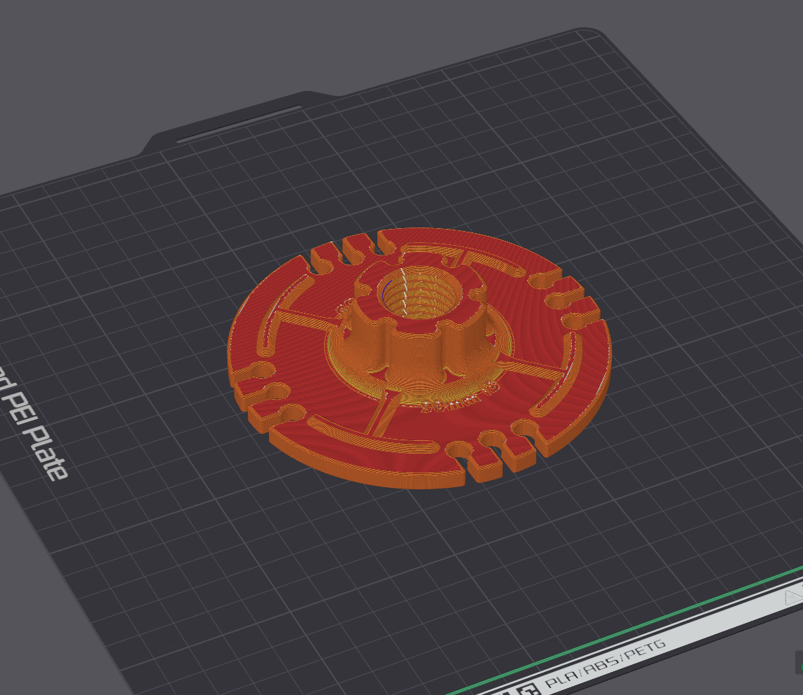

### Note  
This 3mf is for Bambu slicer until someone commits a version for another slicer.  

I have learned that the support and infill settings will not import properly to other slicers.  

Use these settings if you are using another slicer:  

    0.2mm layer height
    0.1mm initial layer height
    0.25mm initial layer line width
    Initial layer flow rate 1.1 (Setting requires developer mode enabled for bambu slicer)
    Standard strength (5 wall) profile
    15% crosshatch or gyroid infill
    10 top shell layers
    10 bottom shell layers
    Hilbert Curve bottom surface pattern

No supports required.

  