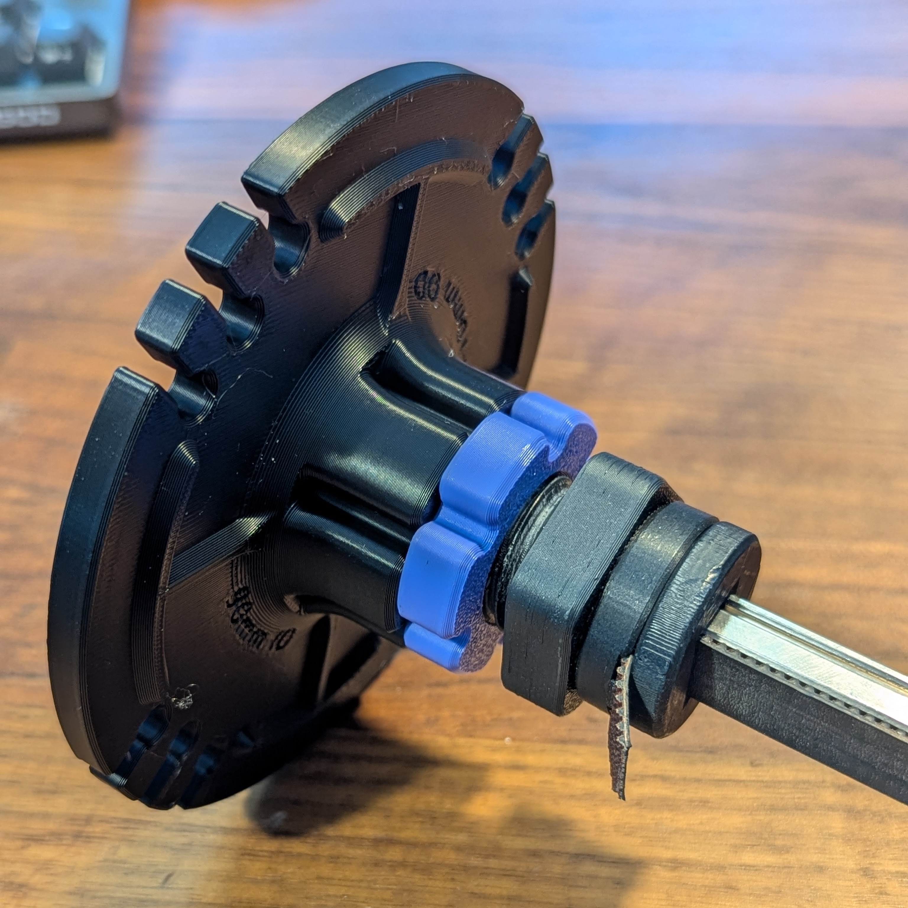
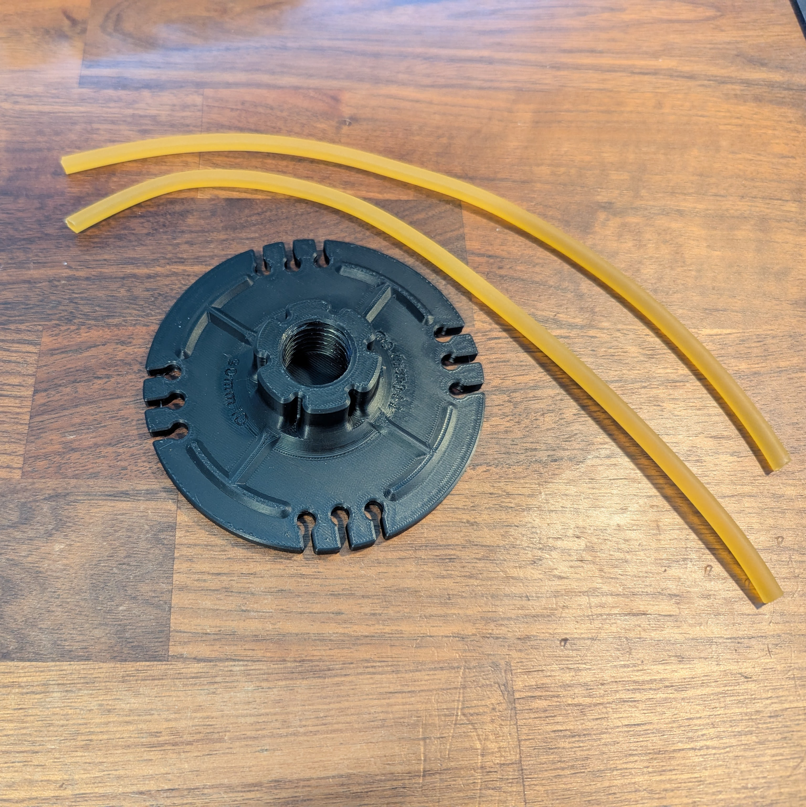
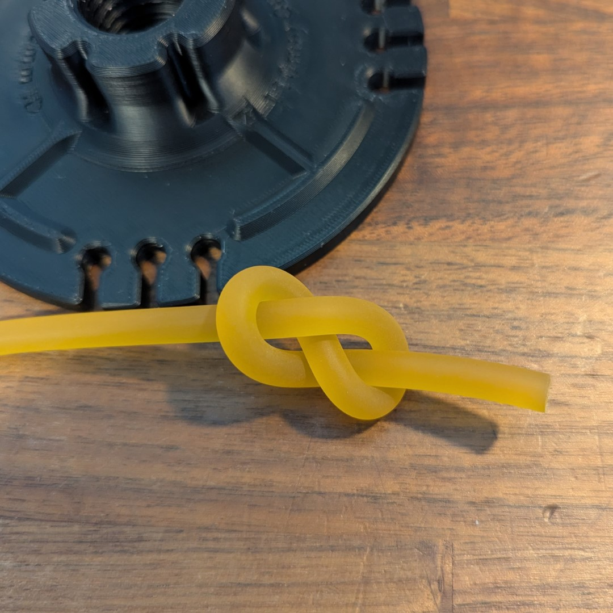
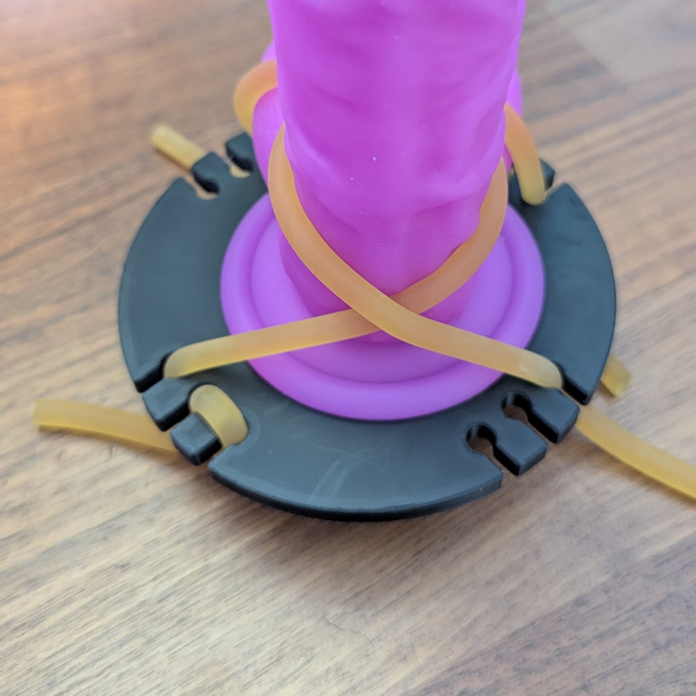
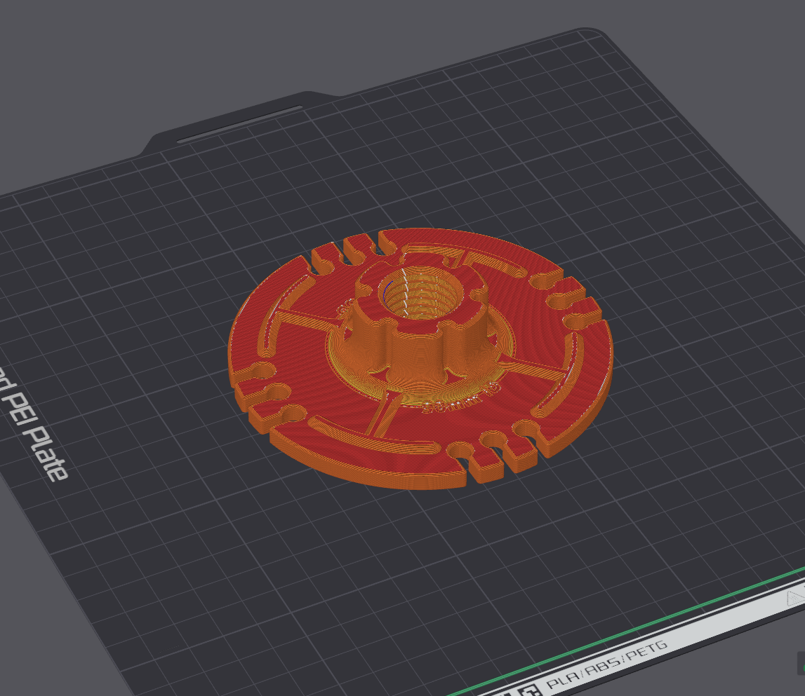

# Tie Down And Suction Plate 110mm

## Summary   
This is a tiedown plate with a pattern of 6mm mounting holes for securing latex tubing or other rope with knotted ends routed to the rear and a robust 24mm thread design with tapered entry.  

Compatibility with suction bases up to 90mm diameter  
Overall plate size of 110mm diameter

## [Print Files](Files/)  
 - Intended to print in the provided file orientation (as seen in slicer preview below)  

## Bill Of Materials

  - 6mm (1/4") solid latex tubing 
    - 2x lengths cut to ~12"

## Assembly

1. Tie an "ininity" knot at all four ends of the latex tubing
2. Route tubing through holes and around toy to secure to base  

    
    

## Printing
    0.2mm layer height
    Standard strength (5 wall) profile
    15% crosshatch or gyroid infill
    10 top shell layers
    10 bottom shell layers
  
No supports required.

A smooth finish for suction cup can be achieved by using a smooth PEI plate  
**Smooth PEI plate preconfigured 3mf file - [OSSM Tie Down And Suction Plate 110mm (Smooth PEI).3mf](Files/Preconfigured%203mf%20Files/)**  

  
